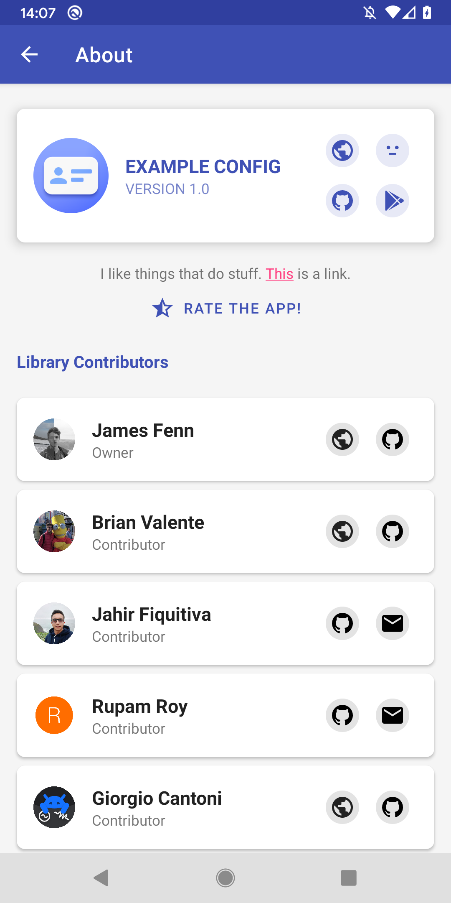
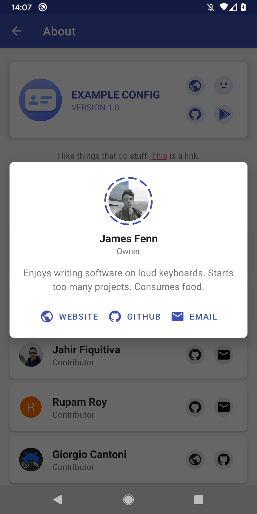
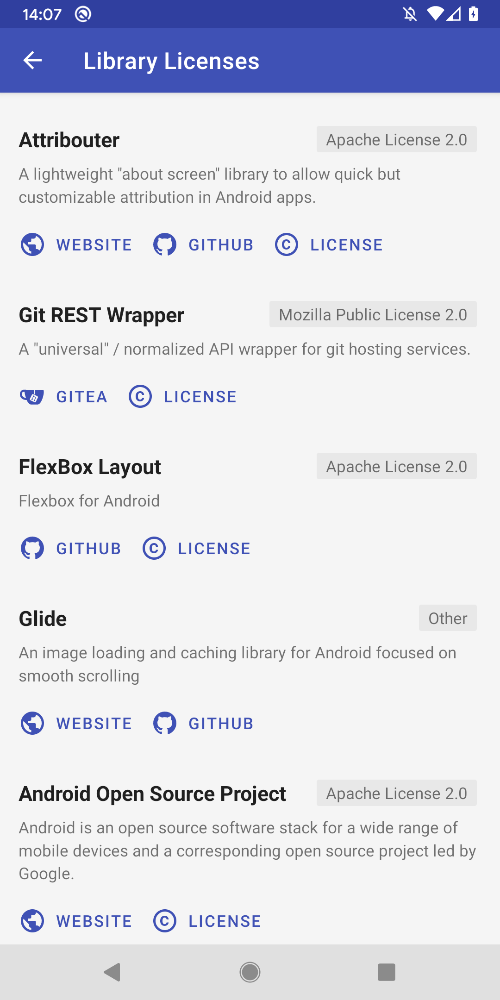
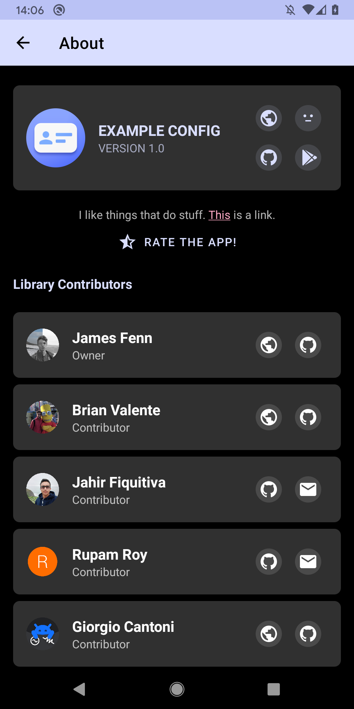

<p align="center"></p>
<h1 align="center">Attribouter</h1>
<p align="center">
    Attribouter is a lightweight "about screen" for Android apps, built for developers to easily credit a project's contributors & dependencies while matching the style of their app. It ships with the ability to fetch metadata directly from GitHub, GitLab, or Gitea (see: <a href="https://code.horrific.dev/james/git-rest-wrapper">git-rest-wrapper</a>), allowing contributors and licenses to be updated or modified without explicit configuration.
</p>
<p align="center">
	<a href="https://jitpack.io/#me.jfenn/Attribouter"></a>
	<a href="https://github.com/fennifith/Alarmio/actions"></a>
	<a href="https://discord.jfenn.me/"></a>
	<a href="https://liberapay.com/fennifith/donate"></a>
	<a href="https://jfenn.me/projects/attribouter/wiki/"></a>
</p>

### Screenshots

| Contributors | Contributor | Licenses | License | Night Theme |
|--------------|-------------|----------|---------|-------------|
|  |  |  |  |  |

### APK

A demo apk of the sample project can be downloaded [here](../../releases/).

## Usage

This library is published on [JitPack](https://jitpack.io), which you can add to your project by copying the following to your root build.gradle at the end of "repositories".

```gradle
allprojects {
  repositories {
    ...
    maven { url 'https://jitpack.io' }
  }
}
```

To add the dependency, copy this line into your app module's build.gradle file.

```gradle
implementation 'me.jfenn:Attribouter:0.1.6'
```

### Starting an Activity
This is pretty simple.

``` kotlin
attribouterActivity {
    withFile(R.xml.attribouter)
    withGitHubToken("abc123")
}
```

<details>
<summary>Java</summary>
<div class="highlight highlight-source-java">
<pre>
Attribouter.from(context)
    .withFile(R.xml.attribouter)
    .withGitHubToken("abc123")
    .show();
</pre>
</div>
</details>

### Creating a Fragment
This is also pretty simple.

``` kotlin
val fragment = attribouterFragment {
    withFile(R.xml.attribouter)
    withGitHubToken("abc123")
}
```

<details>
<summary>Java</summary>
<div class="highlight highlight-source-java">
<pre>
Attribouter.from(context)
    .withFile(R.xml.attribouter)
    .withGitHubToken("abc123")
    .show();
</pre>
</div>
</details>

## Things to Note

### Request Limits

This library does not use an auth key for any REST APIs by default. It does cache data to avoid crossing GitHub's [rate limits](https://developer.github.com/v3/rate_limit/), but if your project has more than a few contributors and libraries *or* you want it to have access to a private repository, you will need to provide an auth token by calling `withGitHubToken(token)` on your instance of `Attribouter`. For GitLab/Gitea instances, tokens can be provided per-hostname - for example, `withToken("code.horrific.dev", token)`.

_Be careful not to include these token with your source code._ There are other methods of providing your token at build-time, such as using a [BuildConfig field](https://developer.android.com/studio/build/gradle-tips#share-custom-fields-and-resource-values-with-your-app-code) with an environment variable, that can prevent this from being an issue. These tokens aren't especially dangerous without any scopes/permissions, but GitHub will automatically deactivate them if they show up in any commits/files on their services, which could cause problems for Attribouter.

### Configuration

By default, Attribouter will use the configuration file at [res/xml/attribouter.xml](./attribouter/src/main/res/xml/attribouter.xml). You can either name your configuration file "attribouter.xml" to override the resource, or name it differently and call `withFile(R.xml.[name])` on your instance of `Attribouter` instead.

The configuration file consists of a single root element, `<about>`, with many child elements that can be placed any amount of times in any order, the same as views in a layout file. These elements, called "wedges" in this library for no apparent reason, are created by Attribouter and added to the page in the order and hierarchy that they are defined in. To create your configuration file, you can either use the [file from the sample project](./app/src/main/res/xml/about.xml) as a template or use [the documentation](https://jfenn.me/projects/attribouter/wiki) to write your own.

### Proguard / Minification

For those using the R8 compiler, Attribouter's [proguard rules](./attribouter/consumer-rules.pro) should be conveniently bundled with the library already - otherwise, you will need to add them to your app's `proguard-rules.pro` file yourself to prevent running into any issues with `minifyEnabled` and the like.

Unfortunately, Attribouter still doesn't behave well with `shrinkResources`, as the compiler cannot detect references from Attribouter's config file and will exclude them from compilation. There is a [workaround](https://developer.android.com/studio/build/shrink-code#shrink-resources) to this, however - create a `<resources>` tag somewhere in your project, and specify `tools:keep="@{resource}"` for all of the strings and drawables referenced by your config file. For all of Attribouter's own resources, this has already been done - and if you are not referencing any other resources in your configuration, then there shouldn't be an issue.

## Used in

- [Lawnchair Launcher](https://github.com/LawnchairLauncher/Lawnchair)
- [EtchDroid](https://github.com/EtchDroid/EtchDroid)
- [Status](https://github.com/fennifith/Status)
- [Alarmio](https://github.com/fennifith/Alarmio)

If you're using Attribouter in your project, feel free to reach out / make a PR to add it to this list!

## How to Contribute

I try to maintain my libraries to meet the needs of all their users - so, to that extent, most contributions will be accepted so long as they represent some kind of functional improvement. I'd much prefer to work together and resolve an issue than turn any genuine effort away. To that end, **if you need help with this process, have any questions or confusion, or want to get feedback before a contribution, please don't hesitate to get in touch.** (either [discord](https://discord.jfenn.me) or [email](mailto:dev@jfenn.me) work fine)

This repository has two persistent branches: `main` and `develop` - of the two, most pull requests should be made to the latter. `main` will always contain the source code of the current stable release, so any new changes should be merged into `develop` first. The exception to this is any changes to metadata: the README, documentation, code of conduct, etc. - since these don't affect the compiled program, it makes sense to merge these into `main` immediately, unless they are tied to a change in functionality (changes in a new version of the library, for example).

### Example contributions

- *Development:* Developers can help Alarmio by fixing bugs, implementing features, or helping to debug & research new issues. I'm hoping to write a complete guide to this process in the future - for now, please refer to [CONTRIBUTING.md](./.github/CONTRIBUTING.md).
- *Design:* Attribouter should be intuitive and accessible to a wide variety of users - suggestions to improve certain interfaces are always welcome. This includes compatibility with screen readers, problems with contrast / color blindness, and the sizing/positioning of touch targets in the UI - many of which are shamefully untested in its present state.
- *Localization:* If Attribouter doesn't have support for your fluent language(s), please consider translating it! Most in-app text is stored in [strings.xml](./attribouter/src/main/res/values/strings.xml) - this file should be copied to ../values-{lang}/strings.xml when translated. (this is an absurdly concise explanation - if this isn't clear, simply sending us translations in a new issue or email is perfectly fine!)
- *Documentation:* Writing guides and explanations of how Attribouter works, how to use it, and how to contribute to it can go a long way to ensuring its usefulness and stability in the future. Whether this involves an update to the README, a tutorial for users and contributors, or adding Javadocs & comments to undocumented parts of the codebase - anything is valid!

## Acknowledgements

Huge thanks to [everyone that's helped with this library](https://github.com/fennifith/Attribouter/graphs/contributors), directly or otherwise!

Also, mega props to [Kevin Aguilar](https://twitter.com/kevttob) and [221 Pixels](https://221pxls.com/) for helping improve the library's design & interface.

### Development

- [@fennifith](https://github.com/fennifith) (me) 
- [@rroyGit](https://github.com/rroyGit)
- [@gcantoni](https://github.com/gcantoni)
- [@divadsn](https://github.com/divadsn)
- [@jahirfiquitiva](https://github.com/jahirfiquitiva)
